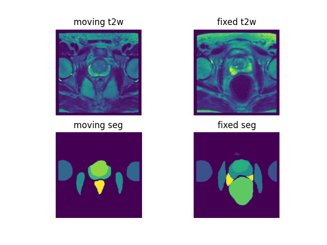

# MedNIST Hand Image Registration

## Downloading the Dataset
Download the dataset [from here](https://zenodo.org/record/7013610) and extract the contents to a convenient location.

The data set includes 589 T2-weighted images acquired from the same number of patients collected by seven studies, 
INDEX, the SmartTarget Biopsy Trial, PICTURE, TCIA Prostate3T, Promise12, TCIA ProstateDx (Diagnosis) and the Prostate 
MR Image Database. Further details are reported in the respective study references.

If you find this labelled data set useful for your research please consider to acknowledge the work: Li, Y., et al. 
"Prototypical few-shot segmentation for cross-institution male pelvic structures with spatial registration." 
arXiv preprint arXiv:2209.05160 (2022). 

## Inference

## Using other data
To train or inference the model on your own data, organise the file directories as following:
```
dataset_dir
├── data
    ├── $PatientID1$_img.nii
    ├── $PatientID1$_mask.nii
    ├── $PatientID2$_img.nii
    ├── $PatientID2$_mask.nii
    ├── ...
```

## Visualize the first pair of images for debugging (requires `matplotlib`)

```bash
python -m monai.bundle run display --config_file configs/inference.yaml
```