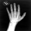

# MedNIST Hand Image Registration

Based on [the tutorial of 2D registration](https://github.com/Project-MONAI/tutorials/tree/main/2d_registration)

## Downloading the Dataset
Download the dataset [from here](https://github.com/Project-MONAI/MONAI-extra-test-data/releases/download/0.8.1/MedNIST.tar.gz) and extract the contents to a convenient location.

The MedNIST dataset was gathered from several sets from [TCIA](https://wiki.cancerimagingarchive.net/display/Public/Data+Usage+Policies+and+Restrictions),
[the RSNA Bone Age Challenge](http://rsnachallenges.cloudapp.net/competitions/4),
and [the NIH Chest X-ray dataset](https://cloud.google.com/healthcare/docs/resources/public-datasets/nih-chest).

The dataset is kindly made available by [Dr. Bradley J. Erickson M.D., Ph.D.](https://www.mayo.edu/research/labs/radiology-informatics/overview) (Department of Radiology, Mayo Clinic)
under the Creative Commons [CC BY-SA 4.0 license](https://creativecommons.org/licenses/by-sa/4.0/).

If you use the MedNIST dataset, please acknowledge the source.

## Training

Training with same-subject image inputs
```bash
python -m monai.bundle run training --config_file configs/train.yaml --dataset_dir "/workspace/data/MedNIST/Hand"
```

Training with cross-subject image inputs
```bash
python -m monai.bundle run training \
  --config_file configs/train.yaml \
  --dataset_dir "/workspace/data/MedNIST/Hand" \
  --cross_subjects True
```

Training from an existing checkpoint file, for example, `models/model_key_metric=-0.0734.pt`:
```bash
python -m monai.bundle run training --config_file configs/train.yaml [...omitting other args] --ckpt "models/model_key_metric=-0.0734.pt"
```

## Inference

The following figure shows an intra-subject (`--cross_subjects False`) model inference results (Fixed, moving and predicted images from left to right)





The command shows an inference workflow with the checkpoint `"models/model_key_metric=-0.0890.pt"` and using device `"cuda:1"`:
```bash
python -m monai.bundle run eval \
  --config_file configs/inference.yaml \
  --ckpt "models/model_key_metric=-0.0890.pt" \
  --logging_file configs/logging.conf \
  --device "cuda:1"
```

## Fine-tuning for cross-subject alignments

The following commands starts a finetuning workflow based on the checkpoint `"models/model_key_metric=-0.0065.pt"`
for `5` epochs using the global mutual information loss.

```bash
python -m monai.bundle run training \
  --config_file configs/train.yaml \
  --cross_subjects True \
  --ckpt "models/model_key_metric=-0.0065.pt" \
  --lr 0.000001 \
  --trainer#loss_function "@mutual_info_loss" \
  --max_epochs 5
```
The following figure shows an inter-subject (`--cross_subjects True`) model inference results (Fixed, moving and predicted images from left to right)


## Visualize the first pair of images for debugging (requires `matplotlib`)

```bash
python -m monai.bundle run display --config_file configs/train.yaml
```

```bash
python -m monai.bundle run display --config_file configs/train.yaml --cross_subjects True
```

# License
Copyright (c) MONAI Consortium

Licensed under the Apache License, Version 2.0 (the "License");
you may not use this file except in compliance with the License.
You may obtain a copy of the License at

    http://www.apache.org/licenses/LICENSE-2.0

Unless required by applicable law or agreed to in writing, software
distributed under the License is distributed on an "AS IS" BASIS,
WITHOUT WARRANTIES OR CONDITIONS OF ANY KIND, either express or implied.
See the License for the specific language governing permissions and
limitations under the License.
