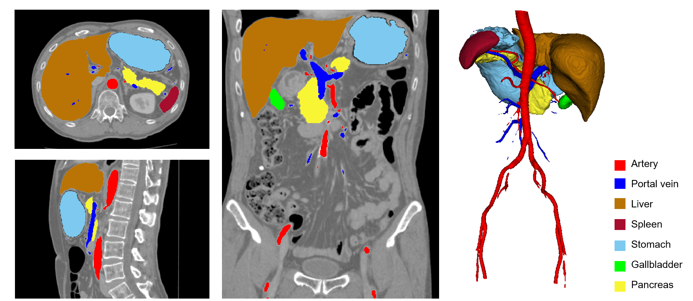

# Multi-organ segmentation in abdominal CT

### **Authors**

Chen Shen<sup>1</sup>, Holger R. Roth<sup>2</sup>, Kazunari Misawa<sup>3</sup>, Kensaku Mori<sup>1</sup>

1. Nagoya University, Japan

2. NVIDIA Corporation, USA

3. Aichi Cancer Center, Japan

### **Tags**

Segmentation, Multi-organ, Abdominal

## **Model Description**

This model uses the DiNTS model architecture searched on [Medical Segmentation Decathlon](http://medicaldecathlon.com/) Pancreas [1] and re-trained for multi-organ segmentation from abdominal CT images [2,3].

## **Data**

This model was trained on an abdominal CT dataset in portal venous phase collected from Aichi Cancer Center in Japan. Since this is a private dataset, similar models can be trained using other public multi-organ datasets like [BTCV](https://www.synapse.org/#!Synapse:syn3193805/wiki/89480).

For this bundle, we split the 420 cases into training, validation and testing with 300, 60 and 60 cases, respectively.

## **Output**
8 channels

- 0: Background
- 1: Artery
- 2: Portal vein
- 3: Liver
- 4: Spleen
- 5: Stomach
- 6: Gallbladder
- 7: Pancreas

Here is an example of output.



## **Scores**

This model achieves the following Dice score on the validation data (our own split from the whole dataset):

Mean Dice = 88.6%

## MONAI Bundle Commands
In addition to the Pythonic APIs, a few command line interfaces (CLI) are provided to interact with the bundle. The CLI supports flexible use cases, such as overriding configs at runtime and predefining arguments in a file.

For more details usage instructions, visit the [MONAI Bundle Configuration Page](https://docs.monai.io/en/latest/config_syntax.html).

#### Execute model searching:

```
python -m scripts.search run --config_file configs/search.yaml
```

#### Execute multi-GPU model searching (recommended):

```
torchrun --nnodes=1 --nproc_per_node=8 -m scripts.search run --config_file configs/search.yaml
```

#### Execute training:

```
python -m monai.bundle run --config_file configs/train.yaml
```

Please note that if the default dataset path is not modified with the actual path in the bundle config files, you can also override it by using `--dataset_dir`:

```
python -m monai.bundle run --config_file configs/train.yaml
```

#### Override the `train` config to execute multi-GPU training:

```
torchrun --nnodes=1 --nproc_per_node=8 \
     -m scripts.search run \
     --config_file configs/search.yaml
```

#### Override the `train` config to execute evaluation with the trained model:

```
python -m monai.bundle run \
    --config_file "['configs/train.yaml','configs/evaluate.yaml']"
```

#### Execute inference:
```
python -m monai.bundle run --config_file configs/inference.yaml
```


#### Export checkpoint for TorchScript:

```
python -m monai.bundle ckpt_export network_def --filepath models/model.ts --ckpt_file models/model.pt --meta_file configs/metadata.json --config_file configs/inference.yaml
```

#### Execute inference with the TensorRT model:

```
python -m monai.bundle run --config_file "['configs/inference.yaml', 'configs/inference_trt.yaml']"
```


## **References**

[1] He, Y., Yang, D., Roth, H., Zhao, C. and Xu, D., 2021. Dints: Differentiable neural network topology search for 3d medical image segmentation. In Proceedings of the IEEE/CVF Conference on Computer Vision and Pattern Recognition (pp. 5841-5850).

​
[2] Roth, Holger R., et al. "A multi-scale pyramid of 3D fully convolutional networks for abdominal multi-organ segmentation." International conference on medical image computing and computer-assisted intervention. Springer, Cham, 2018.
​

[3] Shen, Chen, et al. "Effective hyperparameter optimization with proxy data for multi-organ segmentation." Medical Imaging 2022: Image Processing. Vol. 12032. SPIE, 2022.


## **License**
The Licensee is not allowed to distribute or make the model to any third party, either for free or for a fee. Reverse engineering of the model is not allowed. This includes, but is not limited to, providing the model as part of a commercial offering, sharing the model on a public or private network, or making the model available for download on the Internet.
