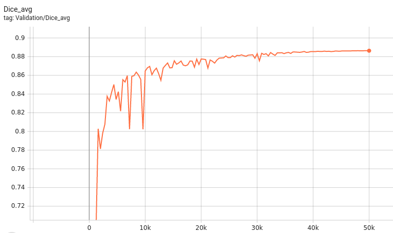

# Description
A pre-trained model for training and inferencing volumetric (3D) kidney substructures segmentation from contrast-enhanced CT images (Arterial/Portal Venous Phase). Training pipeline is provided to support model fine-tuning with bundle and MONAI Label active learning.

A tutorial and release of model for kidney cortex, medulla and collecting system segmentation.

Authors: Yinchi Zhou (yinchi.zhou@vanderbilt.edu) | Xin Yu (xin.yu@vanderbilt.edu) | Yucheng Tang (yuchengt@nvidia.com) |


# Model Overview
A pre-trained UNEST base model [1] for volumetric (3D) renal structures segmentation using dynamic contrast enhanced arterial or venous phase CT images.

## Data
The training data is from the [ImageVU RenalSeg dataset] from Vanderbilt University and Vanderbilt University Medical Center.
(The training data is not public available yet).

- Target: Renal Cortex | Medulla | Pelvis Collecting System
- Task: Segmentation
- Modality: CT (Artrial | Venous phase)
- Size: 96 3D volumes


The data and segmentation demonstration is as follow:

 <br>

## Method and Network

The UNEST model is a 3D hierarchical transformer-based semgnetation network.

Details of the architecture:
 <br>

## Training configuration
The training was performed with at least one 16GB-memory GPU.

Actual Model Input: 96 x 96 x 96

## Input and output formats
Input: 1 channel CT image

Output: 4: 0:Background, 1:Renal Cortex, 2:Medulla, 3:Pelvicalyceal System

## Performance
A graph showing the validation mean Dice for 5000 epochs.

 <br>

This model achieves the following Dice score on the validation data (our own split from the training dataset):

Mean Valdiation Dice = 0.8523

Note that mean dice is computed in the original spacing of the input data.

## commands example
Download trained checkpoint model to ./model/model.pt:


Add scripts component:  To run the workflow with customized components, PYTHONPATH should be revised to include the path to the customized component:

```
export PYTHONPATH=$PYTHONPATH:"'<path to the bundle root dir>/scripts'"

```
Execute Training:

```
python -m monai.bundle run training --meta_file configs/metadata.json --config_file configs/train.json --logging_file configs/logging.conf
```

Execute inference:

```
python -m monai.bundle run evaluating --meta_file configs/metadata.json --config_file configs/inference.json --logging_file configs/logging.conf
```


## More examples output

 <br>


# Disclaimer
This is an example, not to be used for diagnostic purposes.

# References
[1] Yu, Xin, Yinchi Zhou, Yucheng Tang et al. "Characterizing Renal Structures with 3D Block Aggregate Transformers." arXiv preprint arXiv:2203.02430 (2022). https://arxiv.org/pdf/2203.02430.pdf

[2] Zizhao Zhang et al. "Nested Hierarchical Transformer: Towards Accurate, Data-Efficient and Interpretable Visual Understanding." AAAI Conference on Artificial Intelligence (AAAI) 2022

# License
Copyright (c) MONAI Consortium

Licensed under the Apache License, Version 2.0 (the "License");
you may not use this file except in compliance with the License.
You may obtain a copy of the License at

    http://www.apache.org/licenses/LICENSE-2.0

Unless required by applicable law or agreed to in writing, software
distributed under the License is distributed on an "AS IS" BASIS,
WITHOUT WARRANTIES OR CONDITIONS OF ANY KIND, either express or implied.
See the License for the specific language governing permissions and
limitations under the License.
