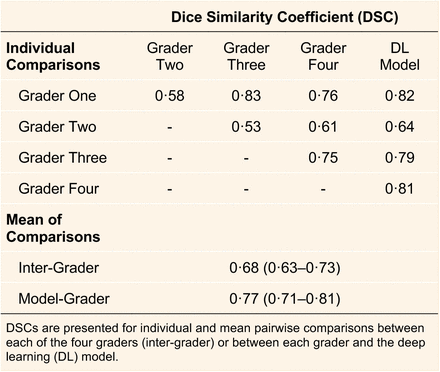
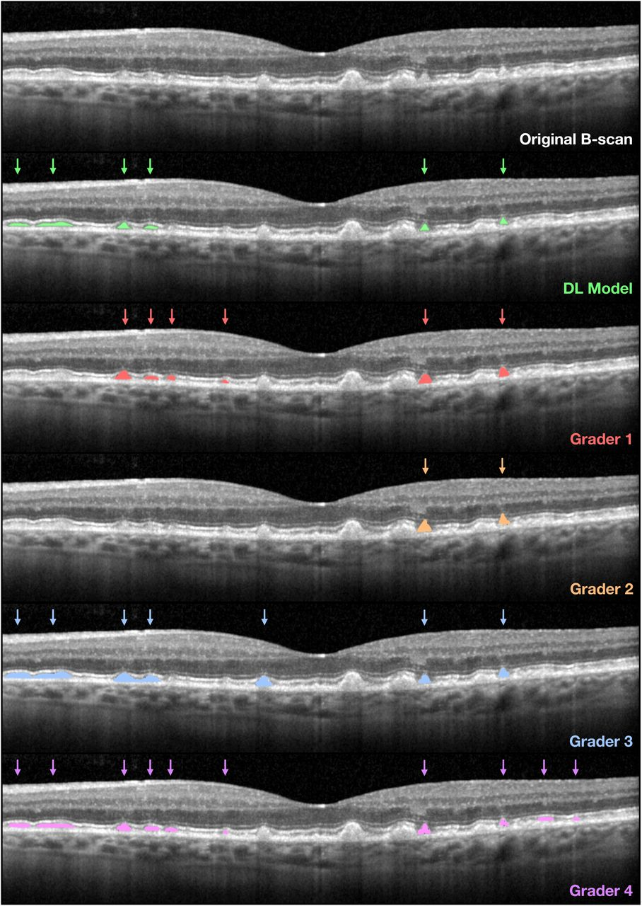

# RPD OCT Segmentation
### **Authors**
Himeesh Kumar, Yelena Bagdasarova, Scott Song, Doron G. Hickey, Amy C. Cohn, Mali Okada, Robert P. Finger, Jan H. Terheyden, Ruth E. Hogg, Pierre-Henry Gabrielle, Louis Arnould, Maxime Jannaud, Xavier Hadoux, Peter van Wijngaarden, Carla J. Abbott, Lauren A.B. Hodgson, Roy Schwartz, Adnan Tufail, Emily Y. Chew, Cecilia S. Lee, Erica L. Fletcher, Melanie Bahlo, Brendan R.E. Ansell, Alice Pébay, Robyn H. Guymer, Aaron Y. Lee, Zhichao Wu

### **Tags**
Reticular Pseudodrusen, AMD, OCT, Segmentation

## **Model Description**
This model detects and segments Reticular Pseudodrusen (RPD) instances in Optical Coherence Tomography (OCT) B-scans. The instance segmentation model used a Mask-RCNN [1] head with the ResNeXt-101-32x8d-FPN [2] backbone (pretrained on ImageNet) implemented via the Detectron2 framework [3]. The model produces outputs that consist of bounding boxes and segmentation masks that delineate the coordinates and pixels of each instance detected, which are assigned a corresponding output probability. A tuneable probability threshold can then be applied to finalise the binary detection of an RPD instance. 

Five segmentation models using these RPD instance labels on the OCT B-scans were trained based on five-fold cross-validation which were used to form a final ensemble model using soft voting (see supplementary material of paper for more information on model training.)

## **Data**
The model was trained using the prospectively-collected, baseline OCT scans (prior to any treatments) of individuals enrolled in the LEAD study [4] imaged using Heidelberg Spectralis HRA+OCT. OCT B-scans from 200 eyes from 100 individuals in the LEAD study were randomly selected to undergo manual annotations of RPD by a single grader (HK) at the pixel level, following training from two senior investigators (RHG and ZW). Only definite RPD lesions, defined as subretinal hyperreflective accumulations that altered the contour of, or broke through, the overlying photoreceptor ellipsoid zone on the OCT B-scans were annotated.

The model was then internally tested in a different set of OCT scans from 125 eyes from 92 individuals from the LEAD study, and externally tested on five independent datasets: the MACUSTAR study [5], the Northern Ireland Cohort for Longitudinal Study of Ageing (NICOLA) study [6], the Montrachet study [7], AMD observational studies at the University of Bonn, Germany (UB), and a routine clinical care cohort seen at the University of Washington (UW). The presence of RPD was graded either as part of each study (MACUSTAR and UB datasets) or graded by one of the study investigators (HK; in the NICOLA, UW, and Montrachet datasets). All these studies defined RPD based on the presence of five or more definite lesions on more than one OCT B-scan that corresponded to hyporeflective lesions seen on near-infrared reflectance imaging. 

#### **Preprocessing**
Scans were kept at native resolution (1024 x 496 pixels).

## **Performance**
In the external test datasets, the overall performance for detecting RPD in a volume scan was (AUC = 0·94; 95% CI = 0·92–0·97). In the internal test dataset, the Dice coefficient (DSC) between the model and manual annotations by retinal specialists for each B-scan was caculated and the average over the dataset is listed in the table below. Note that the DSC was assigned a value of 1·0 to all pairwise comparisons where no pixels on a B-scan were labelled as having RPD. 





For more details regarding evaluation results, please see Results section of paper.

## INSTALLATION
This bundle can be installed using docker by navigating to the RPDBundle directory and running 
```
docker build -t <image_name>:<tag> .
```

## USAGE
The expected image data is in PNG format at the scan level, VOL format at the volume level, or DICOM format at the volume level. To run inference, modify the parameters of the inference.yaml config file in the configs folder which looks like: 

```
imports:
- $import scripts
- $import scripts.inference

args:
  run_extract : False
  input_dir : "/path/to/data"
  extracted_dir : "/path/to/extracted/data"
  input_format : "dicom"
  create_dataset : True
  dataset_name : "my_dataset_name"

  output_dir : "/path/to/model/output"
  run_inference : True
  create_tables : True

# create visuals
  binary_mask : False
  binary_mask_overlay : True
  instance_mask_overlay : False

inference:
- $scripts.inference.main(@args)
```
Then in your bash shell run 
```
BUNDLE="/path/to/budle/RPDBundle"

python -m monai.bundle run inference \
    --bundle_root "$BUNDLE" \
    --config_file "$BUNDLE/configs/inference.yaml" \
    --meta_file "$BUNDLE/configs/metadata.json"
```
### VOL/DICOM EXTRACTION
If extracting DICOM or VOL files:
* set `run_extract` to `True`
* specify `input_dir`, the path to the directory that contains the VOL or DICOM files
* specify `extracted_dir`, the path to the directory where extracted images will be stored
* set `input_format` to "dicom" or "vol" 

The VOL or DICOM files can be in a nested hierarchy of folders, and all files in that directory with a VOL or DICOM extension will be extracted.

For DICOM files, each OCT slice will be saved as a png file to `<extracted_dir>/<SOPInstanceUID>/<SOPInstanceUID>_oct_<DDD>.png` on disk, where `<DDD>` is the slice number.

For VOL files, each OCT slice will be saved as a png file to `<extracted_dir>/<some>/<file>/<name>/<some_file_name>_oct_<DDD>.png` on disk, where `<DDD>` is the slice number and a nested hierarchy of folders is created using the underscores in the original filename. "

### DATASET PACKAGING 
Once you have the scans in PNG format, you can create a "dataset" in Detectron2 dictionary format for model consumption:
* set `create_dataset` to `True`
* set `dataset_name` to the chosen name of your dataset

The dataset dictionary will be saved as pickle file in `/<path>/<to>/<bundle>/RPDBundle/datasets/<your_dataset_name>.pk`

### INFERENCE
To run inference on your dataset:
* set `dataset_name` to the name of your dataset which you create with the previous step and resides in `/<path>/<to>/<bundle>/RPDBundle/datasets/<your_dataset_name>.pk` 
* set `output_dir`, the path to the directory where model predictions and other data will be stored.
* set `run_inference` to `True`

The final ensembled predictions will be saved in COCO Instance Segmentation format in `coco_instances_results.json` in the output directory. The output directory will also be populated with five folders with the preffix 'fold' which contain predictions from the individual models of the ensemble.

### SUMMARY TABLES and VISUAL OUTPUT
Tables and images can be created from the predictions and written to the output directory.
These tables can be created by setting `create_tables` to `True`:
* HTML table called `dfimg_<dataset_name>.html` indexed by OCT-B scan with columns listing the detected number of RPD <em>instances</em> (dt_instances), <em>pixels</em> (dt_pixels), and <em>horizontal pixels</em> (dt_xpxs) in that B-scan.
* HTML table called `dfvol_<dataset_name>.html` indexed by OCT volume with columns listing the detected number of RPD <em>instances</em> (dt_instances), <em>pixels</em> (dt_pixels), and <em>horizontal pixels</em> (dt_xpxs) in that volume.

The predicted segmentations can be output as multi-page TIFFs, where each TIFF file corresponds to an input volume of the dataset, and each page to an OCT slice from the volume in original order. The output images can be binary masks, binary masks overlaying the original B-scan, and instance masks overlaying the original B-scan. Set the `binary_mask`, `binary_mask_overlay` and `instance_mask_overlay` flags in the yaml file to `True` accordingly.

## **System Configuration**
Inference on one Nvidia A100 gpu takes about 0.041 s/batch of 14 images, about 3G of gpu memory, and 6G of RAM.

## **Limitations**
This model has not been tested for robustness of performance on OCTs imaged with other devices and with different scan parameters.

## **Citation Info** 

```
@article {Kumar2024.09.11.24312817,
	author = {Kumar, Himeesh and Bagdasarova, Yelena and Song, Scott and Hickey, Doron G. and Cohn, Amy C. and Okada, Mali and Finger, Robert P. and Terheyden, Jan H. and Hogg, Ruth E. and Gabrielle, Pierre-Henry and Arnould, Louis and Jannaud, Maxime and Hadoux, Xavier and van Wijngaarden, Peter and Abbott, Carla J. and Hodgson, Lauren A.B. and Schwartz, Roy and Tufail, Adnan and Chew, Emily Y. and Lee, Cecilia S. and Fletcher, Erica L. and Bahlo, Melanie and Ansell, Brendan R.E. and P{\'e}bay, Alice and Guymer, Robyn H. and Lee, Aaron Y. and Wu, Zhichao},
	title = {Deep Learning-Based Detection of Reticular Pseudodrusen in Age-Related Macular Degeneration on Optical Coherence Tomography},
	elocation-id = {2024.09.11.24312817},
	year = {2024},
	doi = {10.1101/2024.09.11.24312817},
	publisher = {Cold Spring Harbor Laboratory Press},
	URL = {https://www.medrxiv.org/content/early/2024/09/12/2024.09.11.24312817},
	eprint = {https://www.medrxiv.org/content/early/2024/09/12/2024.09.11.24312817.full.pdf},
	journal = {medRxiv}
}
```

## **References** 
[1]: He, Kaiming, Georgia Gkioxari, Piotr Dollár, and Ross Girshick. "Mask R-CNN." In Proceedings of the IEEE international conference on computer vision (ICCV), pp. 2961-2969. 2017.

[2]: Xie, Saining, Ross Girshick, Piotr Dollár, Zhuowen Tu, and Kaiming He. "Aggregated residual transformations for deep neural networks." In Proceedings of the IEEE conference on computer vision and pattern recognition, pp. 1492-1500. 2017.

[3]: Wu, Yuxin, Alexander Kirillov, Francisco Massa, Wan-Yen Lo, and Ross Girshick. "Detectron2." arXiv preprint arXiv:1902.09615 (2019).

[4]: Liu X, Faes L, Kale AU, et al. A comparison of deep learning performance against health-care professionals in detecting diseases from medical imaging: a systematic review and meta-analysis. The Lancet Digital Health. 2019;1(6):e271–e97.

[5]: Finger RP, Schmitz-Valckenberg S, Schmid M, et al. MACUSTAR: Development and Clinical Validation of Functional, Structural, and Patient-Reported Endpoints in Intermediate Age-Related Macular Degeneration. Ophthalmologica. 2019;241(2):61–72.

[6]: Hogg RE, Wright DM, Quinn NB, et al. Prevalence and risk factors for age-related macular degeneration in a population-based cohort study of older adults in Northern Ireland using multimodal imaging: NICOLA Study. Br J Ophthalmol. 2022:bjophthalmol-2021-320469.

[7]: Gabrielle P-H, Seydou A, Arnould L, et al. Subretinal Drusenoid Deposits in the Elderly in a Population-Based Study (the Montrachet Study). Invest Ophthalmol Vis Sci. 2019;60(14):4838–48.


