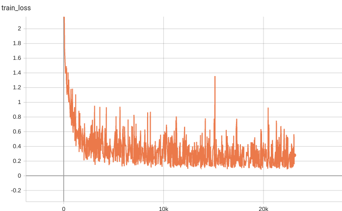
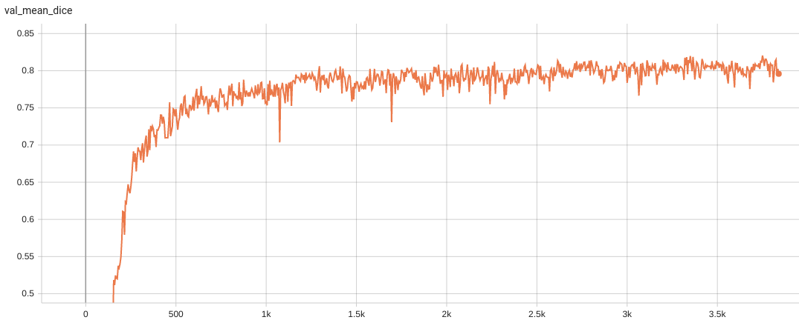

# Model Overview
A pre-trained Swin UNETR [1,2] for volumetric (3D) multi-organ segmentation using CT images from Beyond the Cranial Vault (BTCV) Segmentation Challenge dataset [3].


## Data
The training data is from the [BTCV dataset](https://www.synapse.org/#!Synapse:syn3193805/wiki/89480/) (Register through `Synapse` and download the `Abdomen/RawData.zip`).

- Target: Multi-organs
- Task: Segmentation
- Modality: CT
- Size: 30 3D volumes (24 Training + 6 Testing)

### Preprocessing
The dataset format needs to be redefined using the following commands:

```
unzip RawData.zip
mv RawData/Training/img/ RawData/imagesTr
mv RawData/Training/label/ RawData/labelsTr
mv RawData/Testing/img/ RawData/imagesTs
```

## Training configuration
The training as performed with the following:
- GPU: At least 32GB of GPU memory
- Actual Model Input: 96 x 96 x 96
- AMP: True
- Optimizer: Adam
- Learning Rate: 2e-4


### Input
1 channel
- CT image

### Output
14 channels:
- 0: Background
- 1: Spleen
- 2: Right Kidney
- 3: Left Kideny
- 4: Gallbladder
- 5: Esophagus
- 6: Liver
- 7: Stomach
- 8: Aorta
- 9: IVC
- 10: Portal and Splenic Veins
- 11: Pancreas
- 12: Right adrenal gland
- 13: Left adrenal gland

## Performance
Dice score was used for evaluating the performance of the model. This model achieves a mean dice score of 0.8120

#### Training Loss


#### Validation Dice



## MONAI Bundle Commands
In addition to the Pythonic APIs, a few command line interfaces (CLI) are provided to interact with the bundle. The CLI supports flexible use cases, such as overriding configs at runtime and predefining arguments in a file.

For more details usage instructions, visit the [MONAI Bundle Configuration Page](https://docs.monai.io/en/latest/config_syntax.html).

#### Execute training:

```
python -m monai.bundle run --config_file configs/train.json
```

#### Override the `train` config to execute multi-GPU training:

```
torchrun --standalone --nnodes=1 --nproc_per_node=2 -m monai.bundle run --config_file "['configs/train.json','configs/multi_gpu_train.json']"
```

Please note that the distributed training-related options depend on the actual running environment; thus, users may need to remove `--standalone`, modify `--nnodes`, or do some other necessary changes according to the machine used. For more details, please refer to [pytorch's official tutorial](https://pytorch.org/tutorials/intermediate/ddp_tutorial.html).

#### Override the `train` config to execute evaluation with the trained model:

```
python -m monai.bundle run --config_file "['configs/train.json','configs/evaluate.json']"
```

#### Execute inference:

```
python -m monai.bundle run --config_file configs/inference.json
```

#### Export checkpoint to TorchScript file:

TorchScript conversion is currently not supported.

# References
[1] Hatamizadeh, Ali, et al. "Swin UNETR: Swin Transformers for Semantic Segmentation of Brain Tumors in MRI Images." arXiv preprint arXiv:2201.01266 (2022). https://arxiv.org/abs/2201.01266.

[2] Tang, Yucheng, et al. "Self-supervised pre-training of swin transformers for 3d medical image analysis." arXiv preprint arXiv:2111.14791 (2021). https://arxiv.org/abs/2111.14791.

[3] Landman B, et al. "MICCAI multi-atlas labeling beyond the cranial vault–workshop and challenge." In Proc. of the MICCAI Multi-Atlas Labeling Beyond Cranial Vault—Workshop Challenge 2015 Oct (Vol. 5, p. 12).

# License
Copyright (c) MONAI Consortium

Licensed under the Apache License, Version 2.0 (the "License");
you may not use this file except in compliance with the License.
You may obtain a copy of the License at

    http://www.apache.org/licenses/LICENSE-2.0

Unless required by applicable law or agreed to in writing, software
distributed under the License is distributed on an "AS IS" BASIS,
WITHOUT WARRANTIES OR CONDITIONS OF ANY KIND, either express or implied.
See the License for the specific language governing permissions and
limitations under the License.
