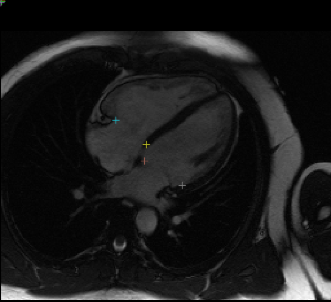

# 2D Cardiac Valve Landmark Regressor

This network identifies 10 different landmarks in 2D+t MR images of the heart (2 chamber, 3 chamber, and 4 chamber) representing the insertion locations of valve leaflets into the myocardial wall. These coordinates are used in part of the construction of 3D FEM cardiac models suitable for physics simulation of heart functions.

Input images are individual 2D slices from the time series, and the output from the network is a `(2, 10)` set of 2D points in `HW` image coordinate space. The 10 coordinates correspond to the attachment point for these valves:

1. Mitral anterior in 2CH
2. Mitral posterior in 2CH
3. Mitral septal in 3CH
4. Mitral free wall in 3CH
5. Mitral septal in 4CH
6. Mitral free wall in 4CH
7. Aortic septal
8. Aortic free wall
9. Tricuspid septal
10. Tricuspid free wall

Landmarks which do not appear in a particular image are predicted to be `(0, 0)` or close to this location. The mitral valve is expected to appear in all three views. Landmarks are not provided for the pulmonary valve.

Example plot of landmarks on a single frame, see [view_results.ipynb](./view_results.ipynb) for visualising network output:



## Training

The training script `train.json` is provided to train the network using a dataset of image pairs containing the MR image and a landmark image. This is done to reuse image-based transforms which do not currently operate on geometry. A number of other transforms are provided in `valve_landmarks.py` to implement Fourier-space dropout, image shifting which preserve landmarks, and smooth-field deformation applied to images and landmarks.

The dataset used for training unfortunately cannot be made public, however the training script can be used with any NPZ file containing the training image stack in key `trainImgs` and landmark image stack in `trainLMImgs`, plus `testImgs` and `testLMImgs` containing validation data. The landmark images are defined as 0 for every non-landmark pixel, with landmark pixels containing the following values for each landmark type:

* 10: Mitral anterior in 2CH
* 15: Mitral posterior in 2CH
* 20: Mitral septal in 3CH
* 25: Mitral free wall in 3CH
* 30: Mitral septal in 4CH
* 35: Mitral free wall in 4CH
* 100: Aortic septal
* 150: Aortic free wall
* 200: Tricuspid septal
* 250: Tricuspid free wall

The MR and landmark images should be 2D with no channel dimension. Within the npz file these images should be stored in single large arrays with the batch dimension first. For example, the contents of the training dataset are:

* trainImgs (8574, 256, 256)
* testImgs (930, 256, 256)
* trainLMImgs (8574, 256, 256)
* testLMImgs (930, 256, 256)

This shows a training set of 8574 image pairs and a test set of 930 image pairs. The transforms provided with the bundle assume these dimensions so your own dataset should stick to this format.

The following command will train with the default NPZ filename `./valvelandmarks.npz`, assuming the current directory is the bundle directory:

```sh
python -m monai.bundle run training --meta_file configs/metadata.json --config_file configs/train.json \
    --bundle_root . --dataset_file ./valvelandmarks.npz --output_dir /path/to/outputs
```

## Inference

The included `inference.json` script will run inference on a directory containing Nifti files whose images have shape `(256, 256, 1, N)` for `N` timesteps. For each image the output in the `output_dir` directory will be a npy file containing a result array of shape `(N, 2, 10)` storing the 10 coordinates for each `N` timesteps. Invoking this script can be done as follows, assuming the current directory is the bundle directory:

```sh
python -m monai.bundle run evaluating --meta_file configs/metadata.json --config_file configs/inference.json \
    --bundle_root . --dataset_dir /path/to/data --output_dir /path/to/outputs
```

The provided test Nifti file can be placed in a directory which is then used as the `dataset_dir` value. This image was derived from [the AMRG Cardiac Atlas dataset](http://www.cardiacatlas.org/studies/amrg-cardiac-atlas) (AMRG Cardiac Atlas, Auckland MRI Research Group, Auckland, New Zealand). The results from this inference can be visualised by changing path values in [view_results.ipynb](./view_results.ipynb).


### Reference

The work for this model and its application is described in:

`Kerfoot, E, King, CE, Ismail, T, Nordsletten, D & Miller, R 2021, Estimation of Cardiac Valve Annuli Motion with Deep Learning. in E Puyol Anton, M Pop, M Sermesant, V Campello, A Lalande, K Lekadir, A Suinesiaputra, O Camara & A Young (eds), Statistical Atlases and Computational Models of the Heart. MandMs and EMIDEC Challenges - 11th International Workshop, STACOM 2020, Held in Conjunction with MICCAI 2020, Revised Selected Papers. Lecture Notes in Computer Science (including subseries Lecture Notes in Artificial Intelligence and Lecture Notes in Bioinformatics), vol. 12592 LNCS, Springer Science and Business Media Deutschland GmbH, pp. 146-155, 11th International Workshop on Statistical Atlases and Computational Models of the Heart, STACOM 2020 held in Conjunction with MICCAI 2020, Lima, Peru, 4/10/2020. https://doi.org/10.1007/978-3-030-68107-4_15`

# License
This model is released under the MIT License. The license file is included with the model.
