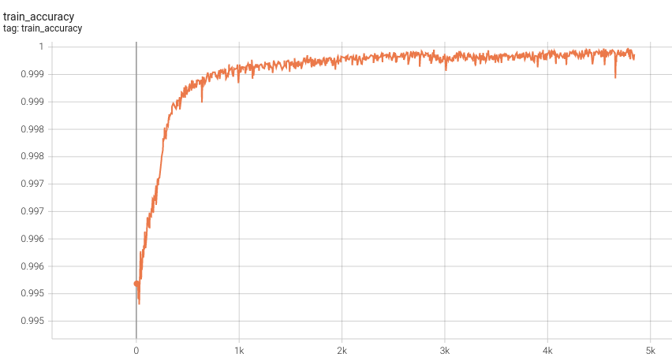
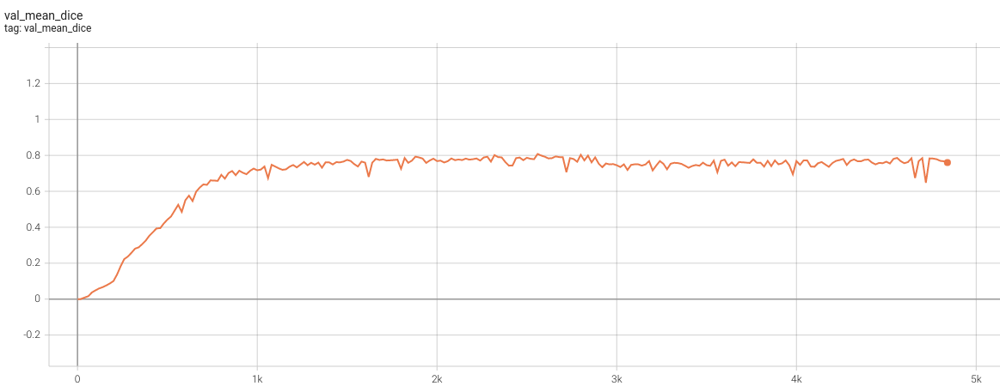

# Model Overview
A pre-trained model for volumetric (3D) segmentation of 104 whole body segments.

This model is trained using the SegResNet [1] network. The model is trained using TotalSegmentator datasets [2].


Figure source from the TotalSegmentator [2].

## Data

The training set is the 104 whole body structures from the TotalSegmentator released datasets. Users can find more details on the datasets at https://github.com/wasserth/TotalSegmentator.

- Target: 104 structures
- Modality: CT
- Source: TotalSegmentator
- Challenge: Large volumes of structures in CT images

## Training configuration

The segmentation of 104 tissues is formulated as the voxel-wise multi-label segmentation. The model is optimized with gradient descent method minimizing Dice + cross entropy loss between the predicted mask and ground truth segmentation.

The training was performed with the following:

- GPU: 32 GB of GPU memory
- Actual Model Input: 96 x 96 x 96
- AMP: True
- Optimizer: AdamW
- Learning Rate: 1e-4
- Loss: DiceCELoss

### Input

One channel
- CT image

### Output

105 channels
- Label 0: Background (everything else)
- label 1-105: Foreground classes (104)

### Resource Requirements

- TODO

### Implementation Details


## Performance

- 3.0 mm Model Training


- 1.5 mm Model Training

  - Training Accuracy

 <br>

  - Validation Dice 

 <br>


#### Training Loss
![A graph showing the training loss over 200 epochs (over 100,000 iterations).]

#### Validation Dice
![A graph showing the validation mean Dice over 100 epochs.]

## MONAI Bundle Commands
In addition to the Pythonic APIs, a few command line interfaces (CLI) are provided to interact with the bundle. The CLI supports flexible use cases, such as overriding configs at runtime and predefining arguments in a file.

For more details usage instructions, visit the [MONAI Bundle Configuration Page](https://docs.monai.io/en/latest/config_syntax.html).

#### Execute training:

```
python -m monai.bundle run training --meta_file configs/metadata.json --config_file configs/train.json --logging_file configs/logging.conf
```

#### Override the `train` config to execute multi-GPU training:

```
torchrun --standalone --nnodes=1 --nproc_per_node=2 -m monai.bundle run training --meta_file configs/metadata.json --config_file "['configs/train.json','configs/multi_gpu_train.json']" --logging_file configs/logging.conf
```

Please note that the distributed training-related options depend on the actual running environment; thus, users may need to remove `--standalone`, modify `--nnodes`, or do some other necessary changes according to the machine used. For more details, please refer to [pytorch's official tutorial](https://pytorch.org/tutorials/intermediate/ddp_tutorial.html).

#### Override the `train` config to execute evaluation with the trained model:

```
python -m monai.bundle run evaluating --meta_file configs/metadata.json --config_file "['configs/train.json','configs/evaluate.json']" --logging_file configs/logging.conf
```

#### Override the `train` config and `evaluate` config to execute multi-GPU evaluation:

```
torchrun --standalone --nnodes=1 --nproc_per_node=2 -m monai.bundle run evaluating --meta_file configs/metadata.json --config_file "['configs/train.json','configs/evaluate.json','configs/multi_gpu_evaluate.json']" --logging_file configs/logging.conf
```

#### Execute inference:

```
python -m monai.bundle run evaluating --meta_file configs/metadata.json --config_file configs/inference.json --logging_file configs/logging.conf
```

# References
[1] Myronenko, A., Siddiquee, M.M.R., Yang, D., He, Y. and Xu, D., 2022. Automated head and neck tumor segmentation from 3D PET/CT. arXiv preprint arXiv:2209.10809.

[2] Wasserthal, J., Meyer, M., Breit, H.C., Cyriac, J., Yang, S. and Segeroth, M., 2022. TotalSegmentator: robust segmentation of 104 anatomical structures in CT images. arXiv preprint arXiv:2208.05868.

# License
Copyright (c) MONAI Consortium

Licensed under the Apache License, Version 2.0 (the "License");
you may not use this file except in compliance with the License.
You may obtain a copy of the License at

    http://www.apache.org/licenses/LICENSE-2.0

Unless required by applicable law or agreed to in writing, software
distributed under the License is distributed on an "AS IS" BASIS,
WITHOUT WARRANTIES OR CONDITIONS OF ANY KIND, either express or implied.
See the License for the specific language governing permissions and
limitations under the License.
