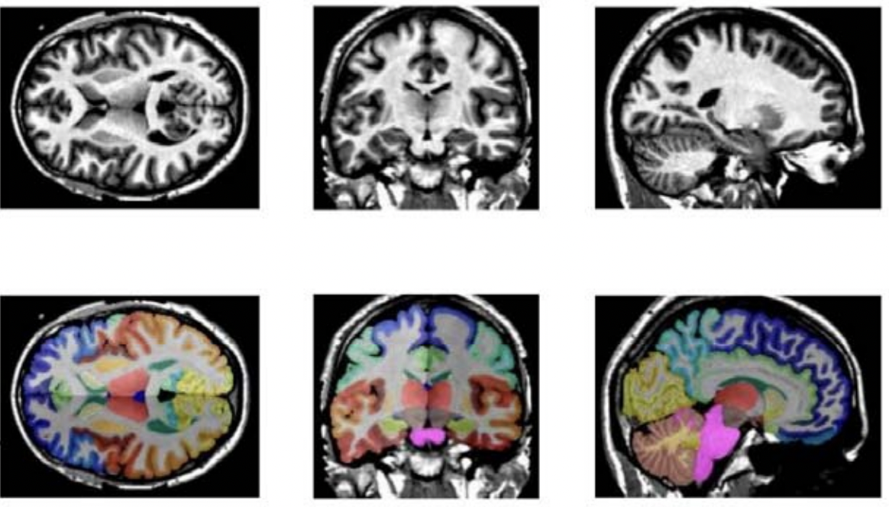
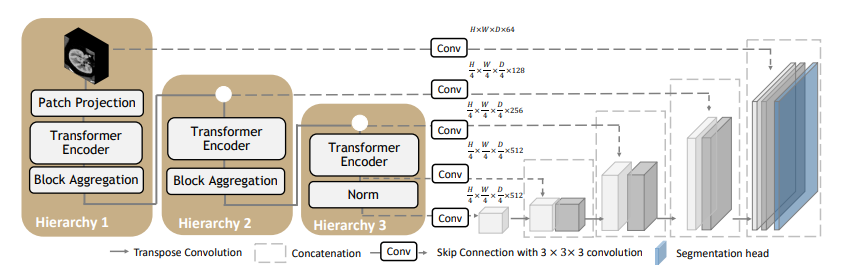
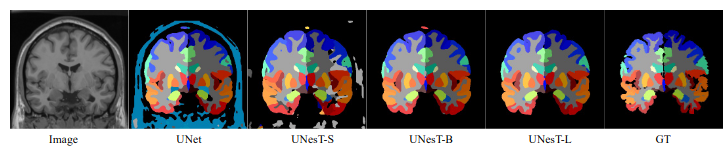
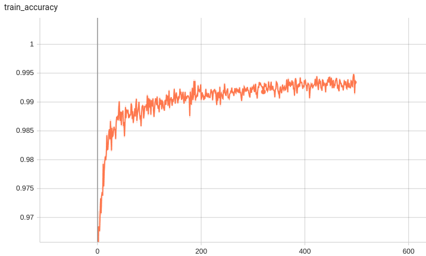
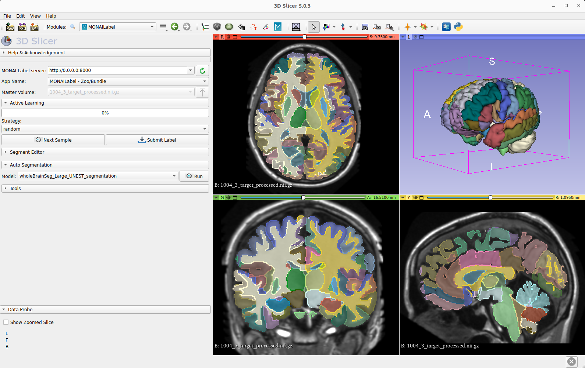

# Description
Detailed whole brain segmentation is an essential quantitative technique in medical image analysis, which provides a non-invasive way of measuring brain regions from a clinical acquired structural magnetic resonance imaging (MRI).
We provide the pre-trained model for training and inferencing whole brain segmentation with 133 structures.
Training pipeline is provided to support active learning in MONAI Label and training with bundle.

A tutorial and release of model for whole brain segmentation using the 3D transformer-based segmentation model UNEST.

Authors:
Xin Yu (xin.yu@vanderbilt.edu)

Yinchi Zhou (yinchi.zhou@vanderbilt.edu) | Yucheng Tang (yuchengt@nvidia.com)

<p align="center">
-------------------------------------------------------------------------------------
</p>

 <br>
<p align="center">
Fig.1 - The demonstration of T1w MRI images registered in MNI space and the whole brain segmentation labels with 133 classes</p>


# Model Overview
A pre-trained UNEST base model [1] for volumetric (3D) whole brain segmentation with T1w MR images.
To leverage information across embedded sequences, ”shifted window” transformers
are proposed for dense predictions and modeling multi-scale features. However, these
attempts that aim to complicate the self-attention range often yield high computation
complexity and data inefficiency. Inspired by the aggregation function in the nested
ViT, we propose a new design of a 3D U-shape medical segmentation model with
Nested Transformers (UNesT) hierarchically with the 3D block aggregation function,
that learn locality behaviors for small structures or small dataset. This design retains
the original global self-attention mechanism and achieves information communication
across patches by stacking transformer encoders hierarchically.

 <br>
<p align="center">
Fig.2 - The network architecture of UNEST Base model
</p>


## Data
The training data is from the Vanderbilt University and Vanderbilt University Medical Center with public released OASIS and CANDI datsets.
Training and testing data are MRI T1-weighted (T1w) 3D volumes coming from 3 different sites. There are a total of 133 classes in the whole brain segmentation task.
Among 50 T1w MRI scans from Open Access Series on Imaging Studies (OASIS) (Marcus et al., 2007) dataset, 45 scans are used for training and the other 5 for validation.
 The testing cohort contains Colin27 T1w scan (Aubert-Broche et al., 2006) and 13 T1w MRI scans from the Child and Adolescent Neuro Development Initiative (CANDI)
 (Kennedy et al., 2012). All data are registered to the MNI space using the MNI305 (Evans et al., 1993) template and preprocessed follow the method in (Huo et al., 2019). Input images are randomly cropped to the size of 96 × 96 × 96.

### Important

The brain MRI images for training are registered to Affine registration from the target image to the MNI305 template using NiftyReg.
The data should be in the MNI305 space before inference.

If your images are already in MNI space, skip the registration step.

You could use any resitration tool to register image to MNI space. Here is an example using ants.
Registration to MNI Space: Sample suggestion. E.g., use ANTS or other tools for registering T1 MRI image to MNI305 Space.

```
pip install antspyx

#Sample ANTS registration

import ants
import sys
import os

fixed_image = ants.image_read('<fixed_image_path>')
moving_image = ants.image_read('<moving_image_path>')
transform = ants.registration(fixed_image,moving_image,'Affine')

reg3t = ants.apply_transforms(fixed_image,moving_image,transform['fwdtransforms'][0])
ants.image_write(reg3t,output_image_path)
```

## Training configuration
The training and inference was performed with at least one 24GB-memory GPU.

Actual Model Input: 96 x 96 x 96

## Input and output formats
Input: 1 channel T1w MRI image in MNI305 Space.


## commands example
Download trained checkpoint model to ./model/model.pt:


Add scripts component:  To run the workflow with customized components, PYTHONPATH should be revised to include the path to the customized component:

```
export PYTHONPATH=$PYTHONPATH: '<path to the bundle root dir>/'
```

Execute Training:

```
python -m monai.bundle run training --meta_file configs/metadata.json --config_file configs/train.json --logging_file configs/logging.conf
```

Execute inference:

```
python -m monai.bundle run evaluating --meta_file configs/metadata.json --config_file configs/inference.json --logging_file configs/logging.conf
```


## More examples output
 <br>
<p align="center">
Fig.3 - The output prediction comparison with variant and ground truth
</p>

## Training/Validation Benchmarking
A graph showing the training accuracy for fine-tuning 600 epochs.

 <br>

With 10 fine-tuned labels, the training process converges fast.

## Complete ROI of the whole brain segmentation
133 brain structures are segmented.

| #1 | #2 | #3 | #4 |
| :------------ | :---------- | :-------- |  :-------- |
| 0:  background  |  1 :  3rd-Ventricle  | 2 :  4th-Ventricle  |  3 :  Right-Accumbens-Area  |
|  4 :  Left-Accumbens-Area  |  5 :  Right-Amygdala  |  6 :  Left-Amygdala  |  7 :  Brain-Stem  |
|  8 :  Right-Caudate  |  9 :  Left-Caudate  |  10 :  Right-Cerebellum-Exterior  |  11 :  Left-Cerebellum-Exterior  |
|  12 :  Right-Cerebellum-White-Matter  |  13 :  Left-Cerebellum-White-Matter  |  14 :  Right-Cerebral-White-Matter  | 15 :  Left-Cerebral-White-Matter  |
|  16 :  Right-Hippocampus  |  17 :  Left-Hippocampus  |  18 :  Right-Inf-Lat-Vent  |  19 :  Left-Inf-Lat-Vent  |
|  20 :  Right-Lateral-Ventricle  |  21 :  Left-Lateral-Ventricle  |  22 :  Right-Pallidum  |  23 :  Left-Pallidum  |
|  24 :  Right-Putamen  |  25 :  Left-Putamen  | 26 :  Right-Thalamus-Proper  |  27 :  Left-Thalamus-Proper  |
|  28 :  Right-Ventral-DC  |  29 :  Left-Ventral-DC  |  30 :  Cerebellar-Vermal-Lobules-I-V  |  31 :  Cerebellar-Vermal-Lobules-VI-VII  |
|  32 :  Cerebellar-Vermal-Lobules-VIII-X  |  33 :  Left-Basal-Forebrain  |  34 :  Right-Basal-Forebrain  |  35 :  Right-ACgG--anterior-cingulate-gyrus  |
|  36 :  Left-ACgG--anterior-cingulate-gyrus  |  37 :  Right-AIns--anterior-insula  |  38 :  Left-AIns--anterior-insula  | 39 :  Right-AOrG--anterior-orbital-gyrus |
| 40 :  Left-AOrG--anterior-orbital-gyrus  |  41 :  Right-AnG---angular-gyrus  |  42 :  Left-AnG---angular-gyrus  |  43 :  Right-Calc--calcarine-cortex  |
|  44 :  Left-Calc--calcarine-cortex  |  45 :  Right-CO----central-operculum  |  46 :  Left-CO----central-operculum  |  47 :  Right-Cun---cuneus  |
|  48 :  Left-Cun---cuneus  |  49 :  Right-Ent---entorhinal-area  |  50 :  Left-Ent---entorhinal-area  |  51 :  Right-FO----frontal-operculum  |
|  52 :  Left-FO----frontal-operculum  |  53 :  Right-FRP---frontal-pole  |  54 :  Left-FRP---frontal-pole  |  55 :  Right-FuG---fusiform-gyrus   |
|  56 :  Left-FuG---fusiform-gyrus  |  57 :  Right-GRe---gyrus-rectus  |  58 :  Left-GRe---gyrus-rectus  |  59 :  Right-IOG---inferior-occipital-gyrus ,
|  60 :  Left-IOG---inferior-occipital-gyrus  |  61 :  Right-ITG---inferior-temporal-gyrus  |  62 :  Left-ITG---inferior-temporal-gyrus  | 63 :  Right-LiG---lingual-gyrus  |
|  64 :  Left-LiG---lingual-gyrus  |  65 :  Right-LOrG--lateral-orbital-gyrus  |  66 :  Left-LOrG--lateral-orbital-gyrus  |  67 :  Right-MCgG--middle-cingulate-gyrus  |
|  68 :  Left-MCgG--middle-cingulate-gyrus  |  69 :  Right-MFC---medial-frontal-cortex  |  70 :  Left-MFC---medial-frontal-cortex  |  71 :  Right-MFG---middle-frontal-gyrus  |
|  72 :  Left-MFG---middle-frontal-gyrus  |  73 :  Right-MOG---middle-occipital-gyrus  |  74 :  Left-MOG---middle-occipital-gyrus  |  75 :  Right-MOrG--medial-orbital-gyrus  |
|  76 :  Left-MOrG--medial-orbital-gyrus  |  77 :  Right-MPoG--postcentral-gyrus  |  78 :  Left-MPoG--postcentral-gyrus  |  79 :  Right-MPrG--precentral-gyrus  |
|  80 :  Left-MPrG--precentral-gyrus  |  81 :  Right-MSFG--superior-frontal-gyrus  |  82 :  Left-MSFG--superior-frontal-gyrus  |  83 :  Right-MTG---middle-temporal-gyrus  |
|  84 :  Left-MTG---middle-temporal-gyrus  |  85 :  Right-OCP---occipital-pole  |  86 :  Left-OCP---occipital-pole  |  87 :  Right-OFuG--occipital-fusiform-gyrus  |
|  88 :  Left-OFuG--occipital-fusiform-gyrus  |  89 :  Right-OpIFG-opercular-part-of-the-IFG  |  90 :  Left-OpIFG-opercular-part-of-the-IFG  |  91 :  Right-OrIFG-orbital-part-of-the-IFG  |
|  92 :  Left-OrIFG-orbital-part-of-the-IFG  |  93 :  Right-PCgG--posterior-cingulate-gyrus  |  94 :  Left-PCgG--posterior-cingulate-gyrus  |  95 :  Right-PCu---precuneus  |
|  96 :  Left-PCu---precuneus  |  97 :  Right-PHG---parahippocampal-gyrus  |  98 :  Left-PHG---parahippocampal-gyrus  |  99 :  Right-PIns--posterior-insula  |
|  100 :  Left-PIns--posterior-insula  |  101 :  Right-PO----parietal-operculum  |  102 :  Left-PO----parietal-operculum  |  103 :  Right-PoG---postcentral-gyrus  |
|  104 :  Left-PoG---postcentral-gyrus  |  105 :  Right-POrG--posterior-orbital-gyrus  |  106 :  Left-POrG--posterior-orbital-gyrus  |  107 :  Right-PP----planum-polare  |
|  108 :  Left-PP----planum-polare  |  109 :  Right-PrG---precentral-gyrus  |  110 :  Left-PrG---precentral-gyrus  |  111 :  Right-PT----planum-temporale  |
|  112 :  Left-PT----planum-temporale  |  113 :  Right-SCA---subcallosal-area  |  114 :  Left-SCA---subcallosal-area  |  115 :  Right-SFG---superior-frontal-gyrus  |
|  116 :  Left-SFG---superior-frontal-gyrus  |  117 :  Right-SMC---supplementary-motor-cortex  |  118 :  Left-SMC---supplementary-motor-cortex  |  119 :  Right-SMG---supramarginal-gyrus  |
|  120 :  Left-SMG---supramarginal-gyrus  |  121 :  Right-SOG---superior-occipital-gyrus  |  122 :  Left-SOG---superior-occipital-gyrus  |  123 :  Right-SPL---superior-parietal-lobule  |
|  124 :  Left-SPL---superior-parietal-lobule  |  125 :  Right-STG---superior-temporal-gyrus  |  126 :  Left-STG---superior-temporal-gyrus  |  127 :  Right-TMP---temporal-pole  |
|  128 :  Left-TMP---temporal-pole  |  129 :  Right-TrIFG-triangular-part-of-the-IFG  |  130 :  Left-TrIFG-triangular-part-of-the-IFG  |  131 :  Right-TTG---transverse-temporal-gyrus  |
|  132 :  Left-TTG---transverse-temporal-gyrus  |


## Bundle Integration in MONAI Lable
The inference and training pipleine can be easily used by the MONAI Label server and 3D Slicer for fast labeling T1w MRI images in MNI space.

 <br>

# Disclaimer
This is an example, not to be used for diagnostic purposes.

# References
[1] Yu, Xin, Yinchi Zhou, Yucheng Tang et al.  Characterizing Renal Structures with 3D Block Aggregate Transformers.  arXiv preprint arXiv:2203.02430 (2022). https://arxiv.org/pdf/2203.02430.pdf

[2] Zizhao Zhang et al.  Nested Hierarchical Transformer: Towards Accurate, Data-Efficient and Interpretable Visual Understanding.  AAAI Conference on Artificial Intelligence (AAAI) 2022

[3] Huo, Yuankai, et al.  3D whole brain segmentation using spatially localized atlas network tiles.  NeuroImage 194 (2019): 105-119.

# License
Copyright (c) MONAI Consortium

Licensed under the Apache License, Version 2.0 (the "License");
you may not use this file except in compliance with the License.
You may obtain a copy of the License at

    http://www.apache.org/licenses/LICENSE-2.0

Unless required by applicable law or agreed to in writing, software
distributed under the License is distributed on an "AS IS" BASIS,
WITHOUT WARRANTIES OR CONDITIONS OF ANY KIND, either express or implied.
See the License for the specific language governing permissions and
limitations under the License.
