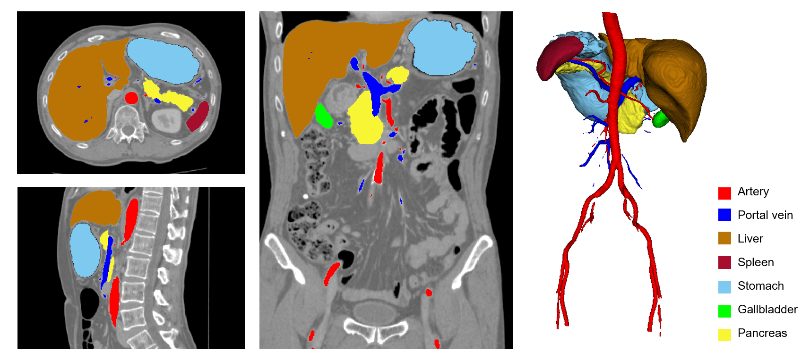

# Multi-organ segmentation in abdominal CT

### **Authors**

Chen Shen<sup>1</sup>, Holger R. Roth<sup>2</sup>, Kazunari Misawa<sup>3</sup>, Kensaku Mori<sup>1</sup>

1. Nagoya University, Japan

2. NVIDIA Corporation, USA

3. Aichi Cancer Center, Japan

### **Tags**

Segmentation, Multi-organ, Abdominal

## **Model Description**

This model uses the DiNTS model architecture searched on [Medical Segmentation Decathlon](http://medicaldecathlon.com/) Pancreas [1] and re-trained for multi-organ segmentation from abdominal CT images [2,3].

## **Data**

This model was trained on an abdominal CT dataset in portal venous phase collected from Aichi Cancer Center in Japan. Since this is a private dataset, similar models can be trained using other public multi-organ datasets like [BTCV](https://www.synapse.org/#!Synapse:syn3193805/wiki/89480).

For this bundle, we split the 420 cases into training, validation and testing with 300, 60 and 60 cases, respectively.

## **Output**
8 channels

- 0: Background
- 1: Artery
- 2: Portal vein
- 3: Liver
- 4: Spleen
- 5: Stomach
- 6: Gallbladder
- 7: Pancreas

Here is an example of output.



## **Scores**

This model achieves the following Dice score on the validation data (our own split from the whole dataset):

Mean Dice = 0.88

## **commands example**

Execute training:

```
python -m monai.bundle run training \
    --meta_file configs/metadata.json \
    --config_file configs/train.yaml \
    --logging_file configs/logging.conf
```

Execute multi-GPU training with 4 GPUs:

```
torchrun --nnodes=4 --nproc_per_node=4 \
    -m monai.bundle run training \
    --meta_file configs/metadata.json \
    --config_file "['configs/train.yaml','configs/multi_gpu_train.yaml']" \
    --logging_file configs/logging.conf
```

Execute inference:

```
python -m monai.bundle run evaluating \
    --meta_file configs/metadata.json \
    --config_file configs/inference.yaml \
    --logging_file configs/logging.conf
```

Override the train config to execute evaluation with the trained model:

```
python -m monai.bundle run evaluating \
    --meta_file configs/metadata.json \
    --config_file "['configs/train.yaml','configs/evaluate.yaml']" \
    --logging_file configs/logging.conf
```

Export checkpoint to TorchScript file:

```
python -m monai.bundle ckpt_export network_def \
    --filepath models/model.ts \
    --ckpt_file models/model.pt \
    --meta_file configs/metadata.json \
    --config_file configs/inference.yaml
```


## **References**

[1] He, Y., Yang, D., Roth, H., Zhao, C. and Xu, D., 2021. Dints: Differentiable neural network topology search for 3d medical image segmentation. In Proceedings of the IEEE/CVF Conference on Computer Vision and Pattern Recognition (pp. 5841-5850).

​
[2] Roth, Holger R., et al. "A multi-scale pyramid of 3D fully convolutional networks for abdominal multi-organ segmentation." International conference on medical image computing and computer-assisted intervention. Springer, Cham, 2018.
​

[3] Shen, Chen, et al. "Effective hyperparameter optimization with proxy data for multi-organ segmentation." Medical Imaging 2022: Image Processing. Vol. 12032. SPIE, 2022.


## **License**
Licensed under the Apache License, Version 2.0 (the "License"); you may not use this file except in compliance with the License. You may obtain a copy of the License at

http://www.apache.org/licenses/LICENSE-2.0

Unless required by applicable law or agreed to in writing, software distributed under the License is distributed on an "AS IS" BASIS, WITHOUT WARRANTIES OR CONDITIONS OF ANY KIND, either express or implied. See the License for the specific language governing permissions and limitations under the License.